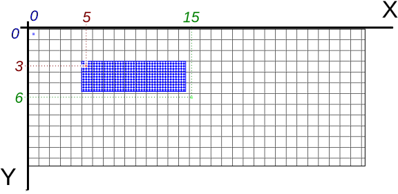
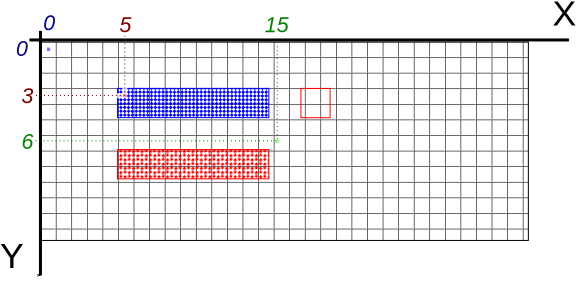

La bibliothèque `qtido` permet de tracer des dessins dans une fenêtre graphique.
Deux modes sont proposés : un mode « tortue » très simple avec seulement quelques instructions, et un mode « normal » proposant beaucoup plus de fonctionnalités.
Une partie dédiée donne [une liste des fonctions de `qtido`](../reference-qtido).

## Donner des ordres à une tortue pour tracer

On imagine une tortue qui porte un stylo et se déplace en traçant un trait sur son chemin.
Au départ la tortue est tournée vers la droite.
La tortue accepte de recevoir différents ordres pour avancer (d'un nombre de pixels), tourner (d'un angle en degrés) ou lever/baisser le stylo.

Voici un exemple, où la tortue trace un triangle équilatéral de coté 100 pixels.
~~~python
from qtido import *

f = creer(800, 600)
t = creer_tortue(f)

tortue_avance(t, 100)
tortue_droite(t, 120)
tortue_avance(t, 100)
tortue_droite(t, 120)
tortue_avance(t, 100)
~~~
{: .source}

> ## Et un triangle rectangle ?
> Écrire un programme qui utilise la tortue pour tracer un triangle rectangle de cotés 30, 40, 50 pixels ?
> 
> Aide :
> On peut utiliser Python pour s'aider à calculer la valeur du/des angles.
> Les fonctions de la bibliothèque `math`, comme `acos` (arc cosinus en radians) et `degrees` (qui convertis des radians en degrés), peuvent être utiles pour calculer le ou les angles nécessaires.
>
> > ## Solution
> > ~~~python
> > from qtido import *
> > import math
> > 
> > f = creer(800, 600)
> > t = creer_tortue(f)
> > 
> > tortue_avance(t, 40)
> > tortue_droite(t, 90)
> > tortue_avance(t, 30)
> > a = 90 + math.degrees(math.acos(40 / 50))
> > tortue_droite(t, a)
> > tortue_avance(t, 50)
> > ~~~
> > {: .source}
> {: .solution}
{: .challenge}

## Tracer des figures géométriques

Les coordonnées pour toutes les opérations de tracé sont exprimées dans un repères en pixels.
Contrairement aux repères en mathématiques :
- le point 0,0 est le premier pixel en haut à gauche de la fenêtre,
- les coordonnées Y augmente vers le bas.

Ainsi le schéma suivant :

illustre ce que fait le programme :

~~~python
from qtido import *

# créer une petite fenêtre de 32x13 pixels
f = creer(32, 13)

# changer la couleur de tracé en bleu
couleur(f, 0, 0, 1)    # quantités de rouge, vert et bleu

# tracer un rectangle allant de 5,3 inclus à 15,6 exclus
rectangle(f, 5, 3, 15, 6)

# attendre 1 seconde pour voir le dessin avant que le programme ne se quitte
attendre_pendant(f, 1000)
~~~
{: .source}

> ## Quel programme trace la figure suivante ?
> Écrire un pogramme qui génère la figure illustrée ci dessous.
> 
> 
> 
> > ## Solution
> > ~~~python
> > from qtido import *
> > f = creer(32, 13)
> > 
> > couleur(f, 0, 0, 1)
> > rectangle(f,  5, 3, 15, 5)
> > couleur(f, 1, 0, 0)
> > rectangle(f,  5, 7, 15, 9)
> > rectangle(f, 17, 3, 19, 5)
> > 
> > attendre_pendant(f, 1000)
> > ~~~
> > {: .source}
> {: .solution}
{: .challenge}
